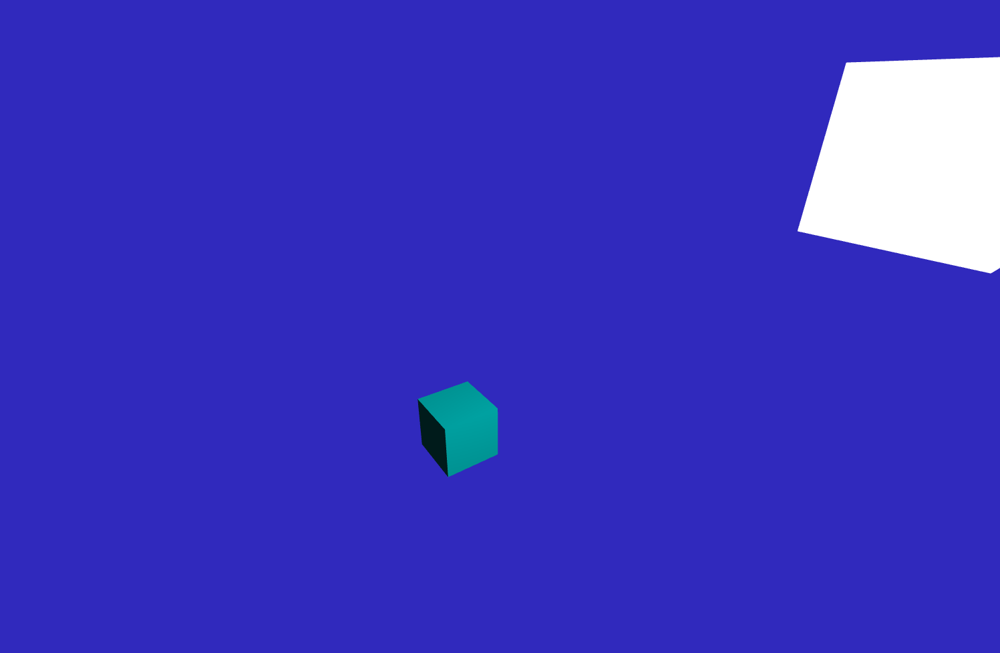
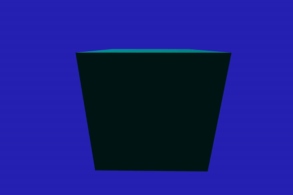

# OPENGL PHONG

After becoming comfortable with the use of VAOs and VBOs, as well as understanding the idea behind the power of shaders, I began to delve into lighting.

I used a lot of references to the leanopengl.com website, which is providing intense amounts of knowledge, which has allowed me to learn and improve my knowledge of OpenGL, Shader languages, physics and maths.

This project is quite unorganised in terms of code style but is not a representation of a final product, but rather a stepping stone in my learning process, to which I can use later in fully-fledged software.

# Showcase!

>

